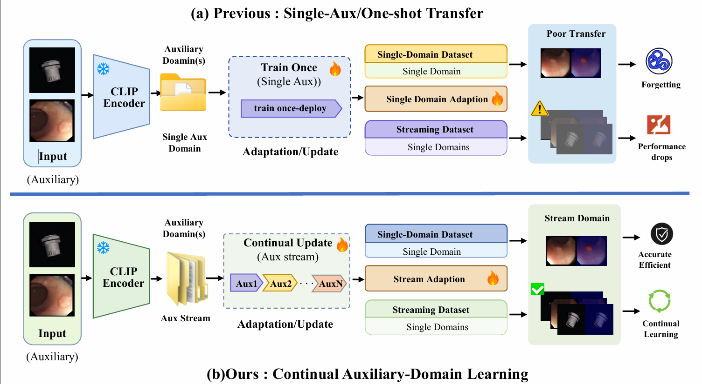

<div align="left"> 
<h1> 📌 LAP: A2T </h1>
<h3>Lifelong Anomaly Perception: Continual Auxiliary to Target Zero-Shot Anomaly Detection</h3>
</div>


<div align="center">  </div>

<div align="justify">

## ⭐ Abstract 
Zero-shot anomaly detection based on vision--language models is typically studied under static settings, whereas real deployments involve sequential domain shifts and continual updates. This mismatch leads to degraded transferability and unstable anomaly localization under streaming adaptation. To address this issue, we propose \textbf{A2T}, a continual \emph{auxiliary-to-target} zero-shot anomaly detection framework under the Lifelong Anomaly Perception (LAP) setting. The key idea is to decouple semantic transfer and structural stability during continual updates. Specifically, we introduce \emph{Stream-aware Continual Prompting} (SCP) to preserve transferable anomaly semantics via anchor-conditioned prompt learning, and \emph{Structure-aware Continual Stabilization} (SCS) to maintain boundary-aware local consistency through patch-consistent regularization and orthogonal-constrained parameter updates. These components are unified under a continual optimization objective that jointly balances semantic alignment, pixel-level supervision, and structural consistency. Extensive experiments on 12 industrial and medical benchmarks demonstrate that A2T consistently outperforms both static zero-shot methods and their streaming extensions, achieving state-of-the-art performance in image-level anomaly detection and pixel-level segmentation, while improving continual stability and boundary quality under domain streams.

</div>

📴**Keywords**: Zero-/Few-Shot, Cross domian, Large Vision-Language Model, Anomaly Classification and Segmentation

<div align="center">  </div>


## 🚀 Get Started

⚙️ Environment
- python >= 3.8.5
- pytorch >= 1.10.0
- torchvision >= 0.11.1
- numpy >= 1.19.2
- scipy >= 1.5.2
- kornia >= 0.6.1
- pandas >= 1.1.3
- opencv-python >= 4.5.4
- pillow
- tqdm
- ftfy
- regex

### Device
Single NVIDIA A40 GPU

## 📦 Pretrained model
- CLIP: ##################################################################

    👉 Download and put it under `CLIP/ckpt` folder


## 🏥🏭 Medical and Industrial Anomaly Detection Benchmark(2D\3D)

1. We will provide the pre-processed benchmark. Please download the following dataset

    

2. Place it within the master directory `data` and unzip the dataset.

    ```
    
    ```


## 📂 File Structure
After the preparation work, the whole project should have the following structure:

```
code
├─ ckpt
│  └─ zero-shot
├─ CLIP
│  ├─ bpe_simple_vocab_16e6.txt.gz
│  ├─ ckpt
│  │  └─ ViT-L-14-336px.pt
│  ├─ clip.py
│  ├─ model.py
│  ├─ models.py
│  ├─ model_configs
│  │  └─ ViT-L-14-336.json
│  ├─ modified_resnet.py
│  ├─ openai.py
│  ├─ tokenizer.py
│  └─ transformer.py
├─ data
│  ├─ Mvtec3D
│  │  ├─ valid
│  │  └─ test
│  ├─ BrainMRI
│  │  ├─ valid
│  │  └─ test
│  ├─ Mvtec
│  │  ├─ valid
│  │  └─ test
│  ├─ ...
│  └─ Visa
│     ├─ valid
│     └─ test
├─ dataset
│  ├─ fewshot_seed
│  │  └─ Mvtec3D
│  ├─ medical_few.py
│  └─ medical_zero.py
├─ loss.py
├─ readme.md
├─ train_few.py
├─ train_zero.py
├─ test.py
└─ utils.py

```


## ⚡ Quick Start

`python test.py`

For example, to test on the BrainMRI , simply run:

`###########################`

### Training

`python train_zero.py`


## 🖼️ Visualization
<center></center>
<center></center>
<center></center>

## 🙏 Acknowledgement
We borrow some codes from [OpenCLIP](https://github.com/mlfoundations/open_clip), and [April-GAN](https://github.com/ByChelsea/VAND-APRIL-GAN).

## 📬 Contact

If you have any problem with this code, please feel free to contact **** and ****.

